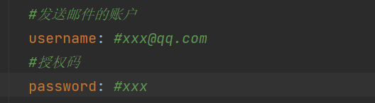

## 需要修改的地方
1. src/main/resources/application.yml
    
    这里的username需要改成自己发送邮件的邮箱
    
    password为发送邮件邮箱的STMT码

    同时，要将数据库的连接信息改成自己的

2. src/main/java/com/kangkang/config/ProjectExceptionAdviceConfig.java
   
    这里的接收邮箱要改成自己接收邮件的邮箱